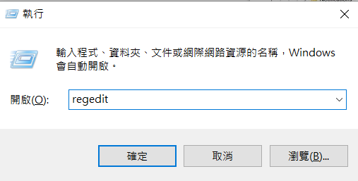
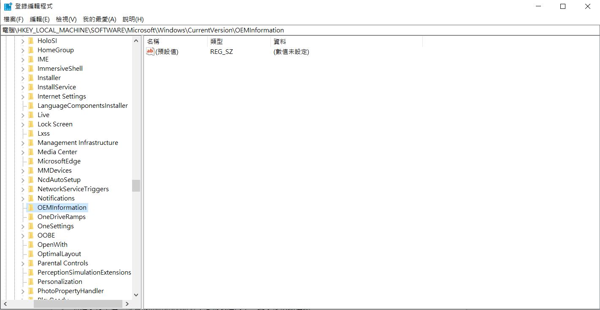

# Windows 更改 OEM 資訊

## _Step 1 開啟註冊表_

Win 鍵 + R 輸入 regedit 確定



## _Step 2 搜索路徑_

搜索路徑: 

HKEY_LOCAL_MACHINE\SOFTWARE\Microsoft\Windows\CurrentVersion\OEMInformation



## _Step 3 _ 新建字符串值_

Manufacturer（製造商）

Model（型號）

SupportHours（售後時間）

SupportPhone（售後電話）

SupportURL（廠商網址）

## _Step 4 _ Logo圖片製作。_

新建 "logo" 字串

添加圖片路徑
```
C:\Windows\System32
```

大小：120 x 120 像素

格式：BMP

色彩深度：32位

## 參考資料

https://kknews.cc/zh-tw/tech/l8abgm9.html

https://answers.microsoft.com/zh-hans/windows/forum/all/%E8%AF%B7%E9%97%AEwindows/e0588617-856c-4779-90f3-5296104037ba
