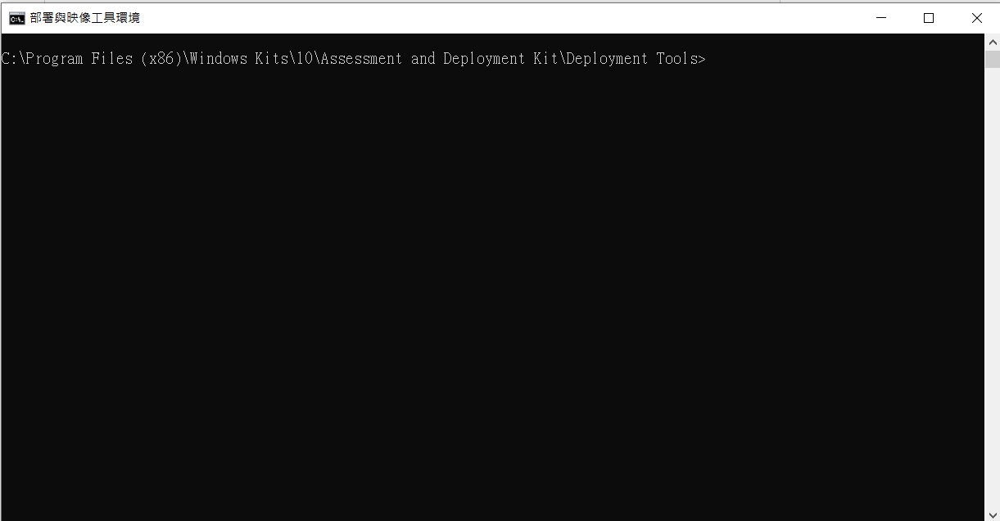

# Windows 母檔製作 #1

## *Win10 PE製作*

_建立可開機的 WinPE_

### _Step 1: 將 USB 隨身碟插入電腦_

### _Step 2: 下載及安裝 Windows ADK_
* Windows ADK工具可快速製作WinPE、建立自訂範本
* 挑選當前電腦對應版本的Windows ADK與Windows ADK Windows PE附加元件:

https://learn.microsoft.com/zh-tw/windows-hardware/get-started/adk-install#other-adk-downloads

### _Step 3: 確認USB磁碟路徑:_
* 開啟CMD輸入diskpart:
```
diskpart
```
* 使用 diskpart 列出磁片，以便識別 USB 磁片磁碟機：
```
lsit disk
```
* 應該會看到類似的內容：
```
Disk ###  Status         Size     Free     Dyn  Gpt
--------  -------------  -------  -------  ---  ---
Disk 0    Online          238 GB      0 B        *
Disk 1    Online          14578 MB     0 B      
```
* 當識別 USB 磁片磁碟機的磁片編號時，建立開機媒體:
```
Select disk 1
clean
create partition primary
select partition 1
active
Format fs=fat32 quick
assign
exit
```
### _Step 4: 開啟"部屬與映像工具"：_

```路徑
[開始] 功能表 / [Windows Kits] / [部署和映射工具] 
```


### _Step 5: 將 WinPE 檔案複製到工作資料夾：_

```
copype amd64 C:\WinPE 
```
此命令會將 64 位 WinPE 檔案複製到 C：\WinPE。 注意：將會自動建立目的地資料夾。

### _Step 6: 將 WinPE 檔案複製到 USB 金鑰。_
```
makewinpemedia /ufd C:\WinPE D:
```
其中 D： 是 USB 磁片磁碟機。 此命令會格式化 USB 磁片磁碟機，並清除其上的任何資料。

## 參考資料
* Microsoft learm Lab 1a:   
https://learn.microsoft.com/zh-tw/windows-hardware/manufacture/desktop/iot-ent-create-a-basic-image?view=windows-11
* Microsoft learm Lab 4:  
https://learn.microsoft.com/zh-tw/windows-hardware/manufacture/desktop/iot-ent-sysprep-capture-deploy?view=windows-11
* Download windows ADK:  
https://learn.microsoft.com/zh-tw/windows-hardware/get-started/adk-install