# Windows 母檔製作 #2

## *修改語言包*
### 事前準備

* 要修改的 Windows 安裝映像 (例如 ISO 或是光碟)。
* 希望整合的 Windows 語言套件。
* 安裝符合欲修改之 Windows 安裝映像版本的 ADK (Assessment and Deployment Kit) 套件或 AIK (Automated Installation Kit) 套件 (Windows 7 或更早版本)，請安裝「Windows 預先安裝環境 (Windows Preinstallation Environment)」此項。

接下來請在硬碟內準備一個工作目錄 (範例中使用 C:\Workspace)，並在其下建立兩個子目錄，一個用於放置安裝映像解壓縮後的檔案 (C:\Workspace\win10)，另一個則是用於暫時掛載並用於檔案處理的暫存目錄 (C:\Workspace\mount)。

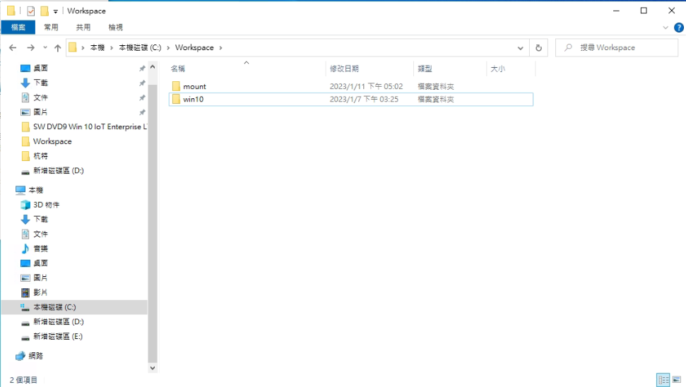

**注意windows iso 與語言包需自行下載這邊不做提供*
## Stage 1. - 分析安裝鏡像
一份 Windows 安裝映像內包含了多個 SKU (例如家用版、專業版、企業版等)，因此各個 SKU 在受到 DISM 工具修改時是不會同時受到影響，只有被指定的 SKU 才會被 DISM 工具修改。

### _Step1: 將安裝映像解壓縮到工作目錄內。_

由於安裝映像是 ISO 格式的，因此在開始之前請先將 ISO 內的所有檔案解壓縮到工作目錄內 (如果是使用安裝光碟的話，由於光碟不可寫入因此請將光碟內的所有檔案複製到工作目錄內)

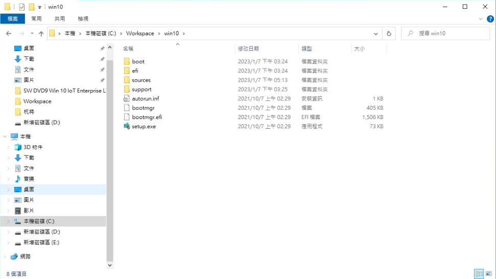

### _Step2: 以系統管理權限開啟cmd，並將當前目錄移至工作目錄_ 

由於 DISM 需要系統管理權限才能執行，因此請務必使用系統管理權限開啟cmd，並且將當前目錄移至剛剛建立的工作目錄內(範例C:\Workspace)。

### _Step3: 執行分析命令_ 
```
dism /get-wiminfo /wimfile:<安裝映像目錄>\sources\install.wim
```
目前使用的安裝映像 (Windows 10 Enterprist LTSC) 為例，可以看到經過分析後此份安裝映像內其時有兩個 SKU，分別是具備 GUI 的 LTSC 跟 LTSC IoT 兩種。


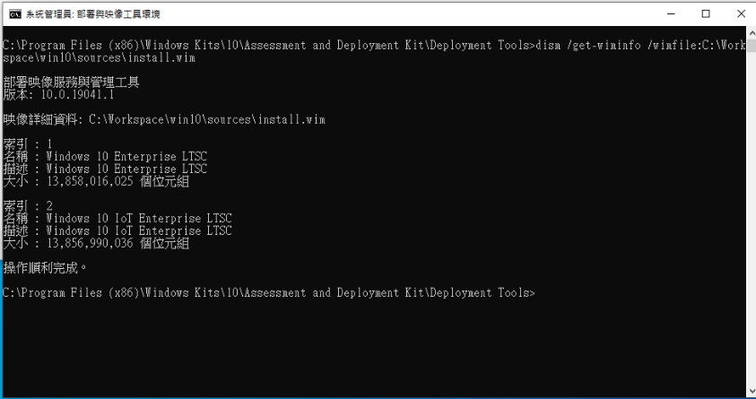

請記下各個項目的索引編號，在接下來掛載映像時會用到。

## Stage 2. - 掛載映像並整合語言套件

### _Step 1：掛載映像_
```
dism /mount-wim /wimfile:<安裝映像目錄>\sources\install.wim /index:1 /mountdir:<掛載目錄>
```
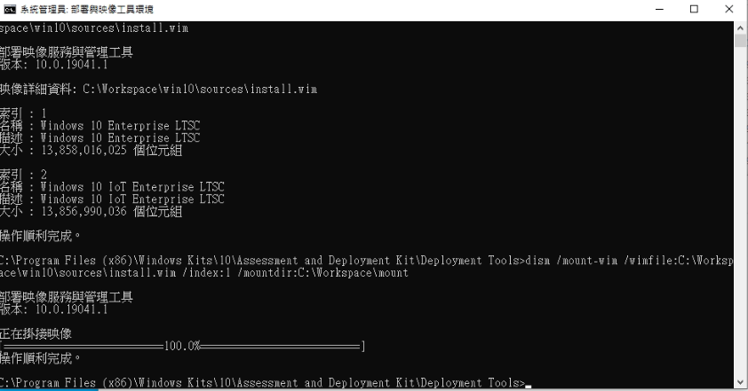

### _Step 2：整合語言套件_

語言套件塞入此 SKU 中了，請執行下面這個指令：
```
dism /image:<掛載目錄> /add-package /packagepath:<語言套件所在路徑>
```
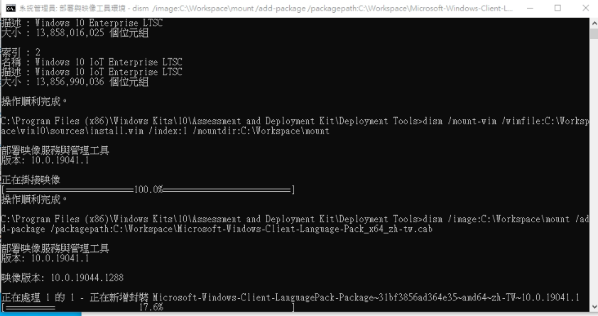

### _Step 3：變更首選語言參數_

在變更之前你可以使用下面這行指令來檢視目前的語言參數：
```
dism /image:<掛載目錄> /get-intl
```
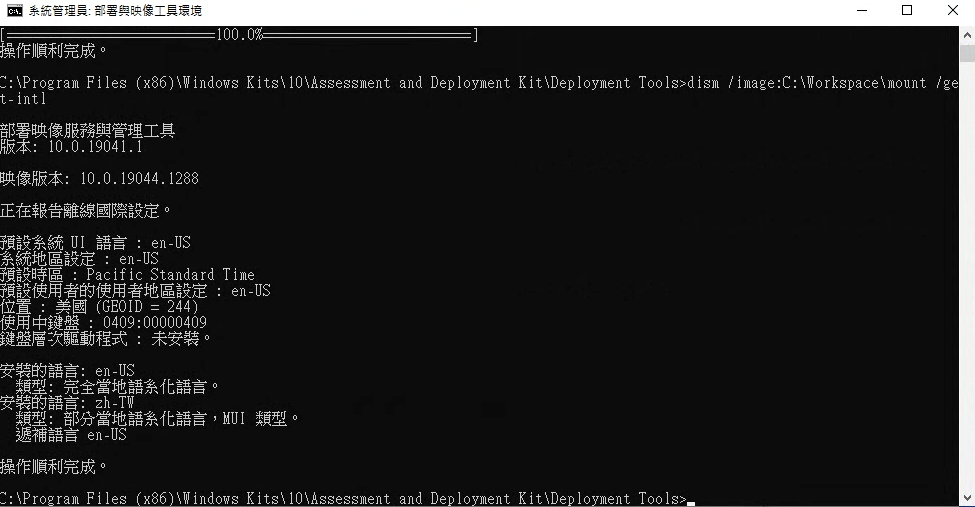

要變更預設語言參數只需要執行下面這行指令就行了 (請將 zh-tw 替換為要設定為首選的語言)：
```
dism /image:<掛載目錄> /Set-SKUIntlDefaults:zh-tw
```
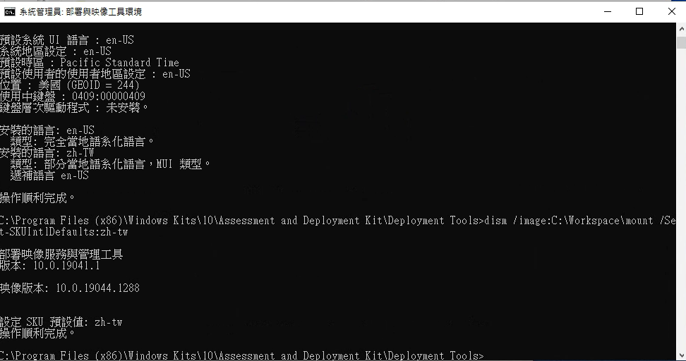

之後再次執行查詢指令可以確認變更為繁體中文 (台灣)。
```
dism /image:<掛載目錄> /get-intl
```
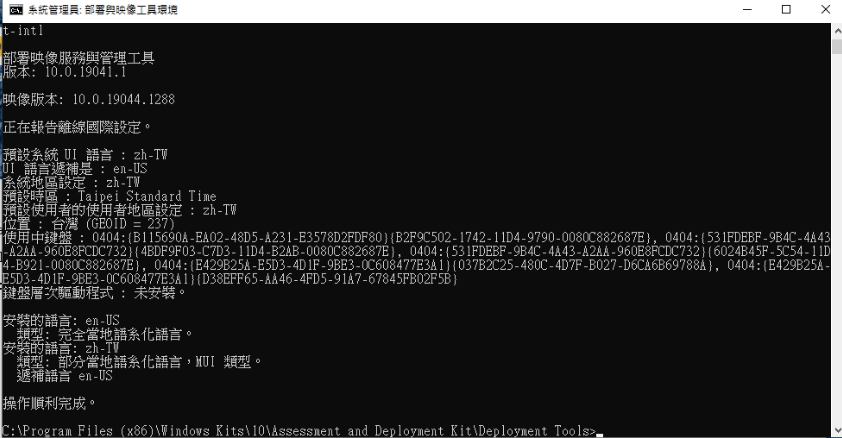

### _Step 4：產生語系設定檔 (lang.ini)_

在加入新語言套件之後需要產生新的語系資訊檔 (lang.ini)，安裝程式才得以得知這個語言套件已經被加入安裝映像中，請執行下面的指令：
```
dism /image:<掛載目錄> /gen-langINI /distribution:<安裝映像所在路徑>
```
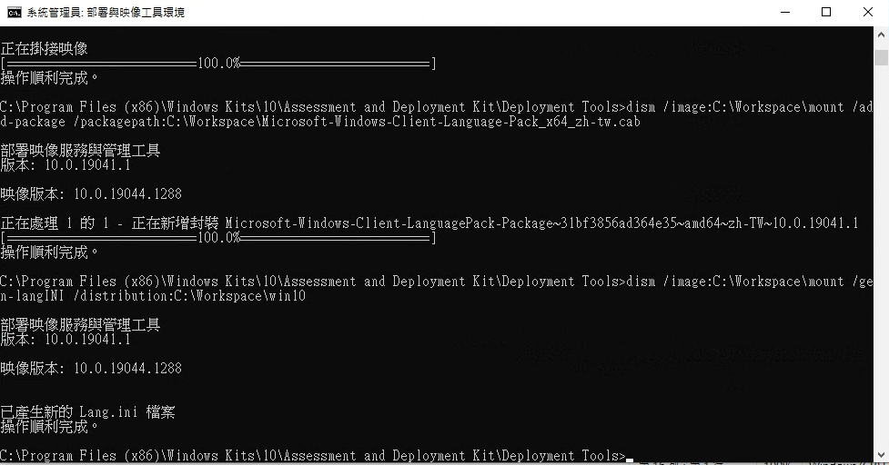

### _Step 5：設定安裝程式預設語言_

接下來的步驟是指定此安裝映像預設要使用的安裝程式介面語言，請執行下列指令：
```
dism /image:<掛載目錄> /Set-SetupUILang:<語言> /distribution:<安裝映像所在路徑>
```
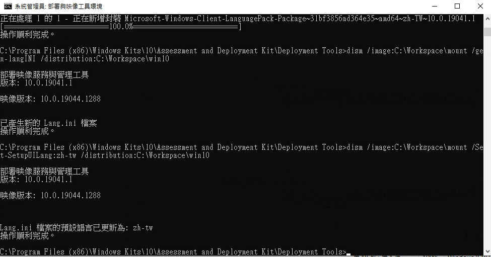

### _Step 6：將變更寫入檔案_

由於目前變更只寫入到掛載目錄內，並沒有修改 install.wim 的內容，因此接下來我們要進行卸載並將修改寫入檔案的程序，請執行下面這行指令：
```
dism /unmount-image /mountdir:<掛載目錄> /commit
```

### _Step 7：繼續處理其他 SKU_

目前Step 1~7的步驟中只是修改了SKU 1的語言選項，所以需要重複1~7的步驟，把剩下的SKU宜並做修改(請把Step 1 中的 index:1 依序修改順序)

## Stage 3. - 處裡預先安裝環境

當透過 Windows 安裝映像啟用電腦時，是透過 WinPE 開機，並不是載入整套完整的 Windows 系統，而這套預先安裝環境則是壓縮封裝在安裝映像內的 boot.wim 檔案之中。

### _Step 1：將開機介面用字型檔整合到開機管理程式_

由於繁體中文字型檔體積較大，因此預設並沒有包含在 Windows 預先安裝環境中，因此在製作預先安裝環境時需要先將字型檔整合到 boot.wim 內，開機時才不會發生亂碼與無法載入的情形，請使用下面這個指令將預先安裝環境的第一部分 (開機管理程式) 掛載起來。
```
dism /mount-wim /wimfile:<安裝映像目錄>\sources\boot.wim /index:1 /mountdir:<掛載目錄>
```
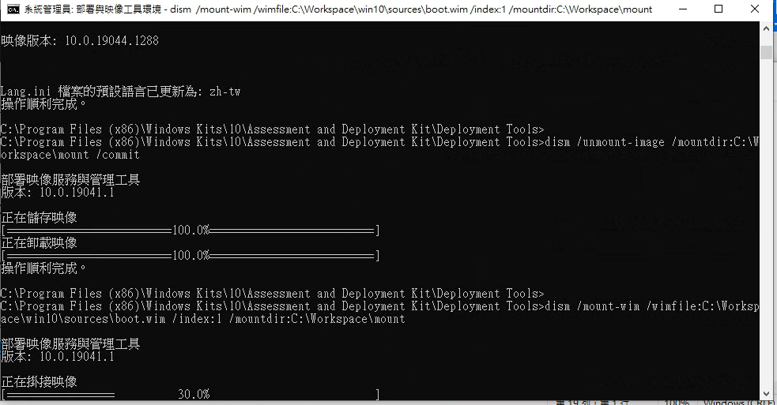

接下來要將字型檔整併入預先安裝環境中，字型檔的部分可以在前置準備時安裝的 ADK (AIK) 中取得，一般來說會放在 C:\Program Files (x86)\Windows Kits\<版本>\Assessment and Deployment Kit\Windows Preinstallation Environment\<架構>\WinPE_OCs\ 目錄內，以 WinPE-FontSupport-<語系名稱>.cab 命名。

```
dism /image:<掛載目錄> /add-package /packagepath:<字型檔所在路徑>
```

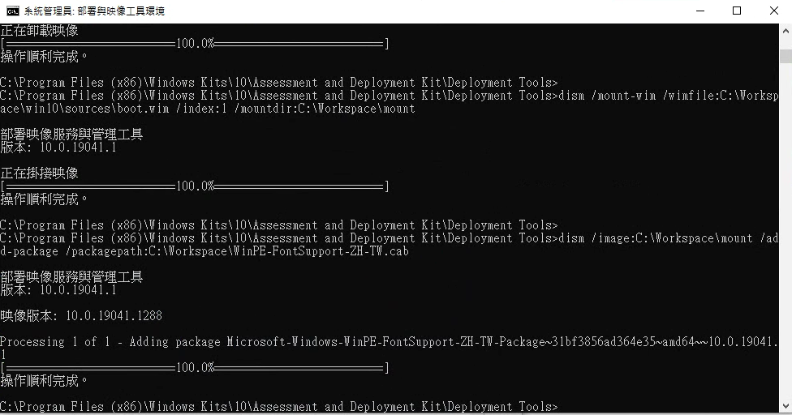

### _Step 2：將預先安裝環境語言包整合到預先安裝環境內_

接下來要把預先安裝環境的完整語言包整合進去囉，由於預先安裝環境的語言包拆成很多個檔案，因此在這邊與前面不同，要直接將整個目錄下的所有 cab 包整合到預先安裝環境內，基本上預先安裝環境的語言套件是放置於 C:\Program Files (x86)\Windows Kits\<版本>\Assessment and Deployment Kit\Windows Preinstallation Environment\<架構>\WinPE_OCs\<語系> 目錄內。

```
dism /image:<掛載目錄> /add-package /packagepath:<語系檔所在路徑>
```

*由於 Windows PE 語系檔實際上分成二十幾個部分，所以直接安裝目錄，請注意目錄路徑最後請不要加上”/”，否則可能會出現錯誤。*

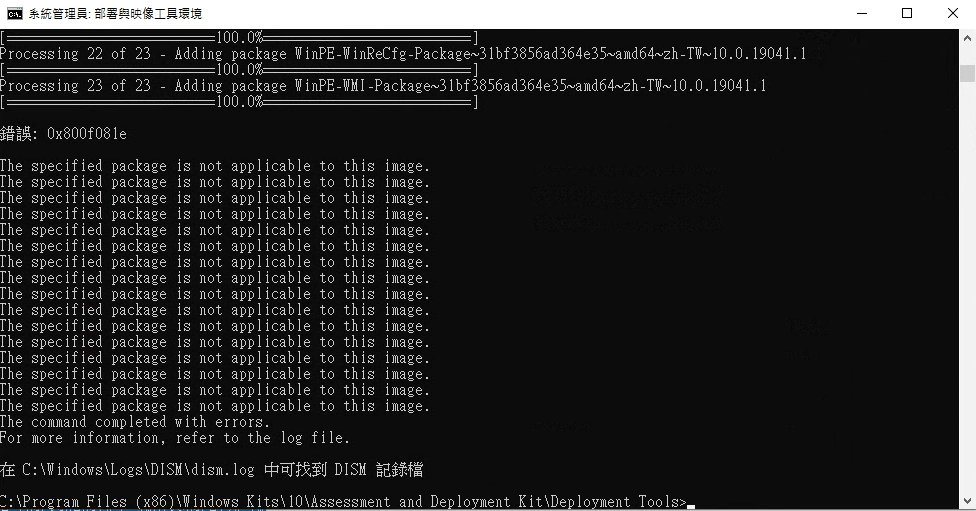

這步驟最後出現錯誤是正常的，因為語系檔中有一些並不適用於當前製作中的安裝映像，因此不會被裝入預先安裝環境中。

### _Step 3：將語系資訊檔 (lang.ini) 放入 boot.wim_

接下來的步驟是將之前產生的語系資訊檔 (lang.ini) 放入 boot.wim 中，以讓安裝程式得以運用這個檔案判斷安裝映像內包含的語言版本

```
xcopy <安裝映像目錄>\sources\lang.ini <掛載目錄>\sources\lang.ini
```

### _Step 4：將變更寫入檔案_

將掛載資料夾回寫至 win.boot 安裝檔中
```
dism /unmount-image /mountdir:<掛載目錄> /commit
```

### _Step 5：重複更改SKU_

重複 Step 1~4 將安中檔中其餘SKU依序做出修改

```
dism /mount-wim /wimfile:<安裝映像目錄>\sources\boot.wim /index:<SKU數字> /mountdir:<掛載目錄>
```
## Stage 4. - 修改安裝程式語系

將語言套件解壓縮後把 setup 目錄底下的語系資源檔案直接放進安裝映像目錄內就行了，由於語言套件內的檔案很多，因此載入可能需要一點時間。

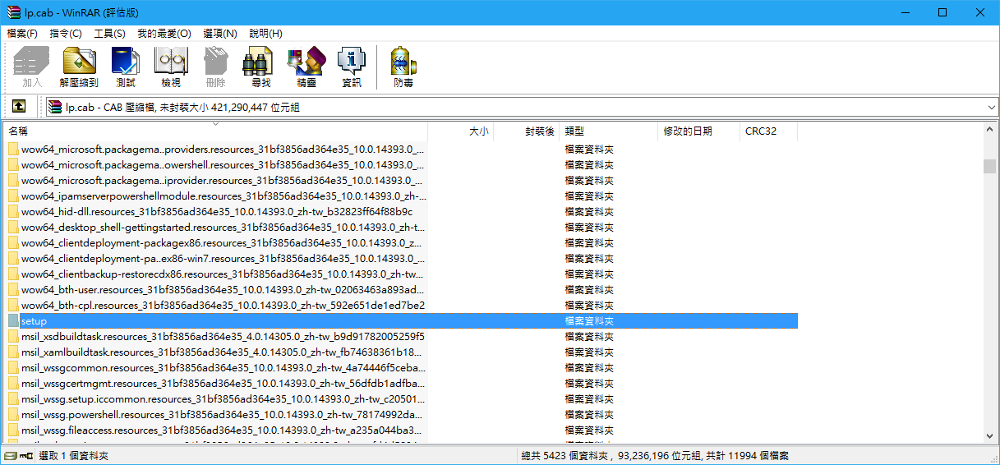

## 成品概觀

後續將整個安裝映像目錄內的檔案運用微軟官方的 CDImage 等工具製作成可開機格式的 ISO 映像即可

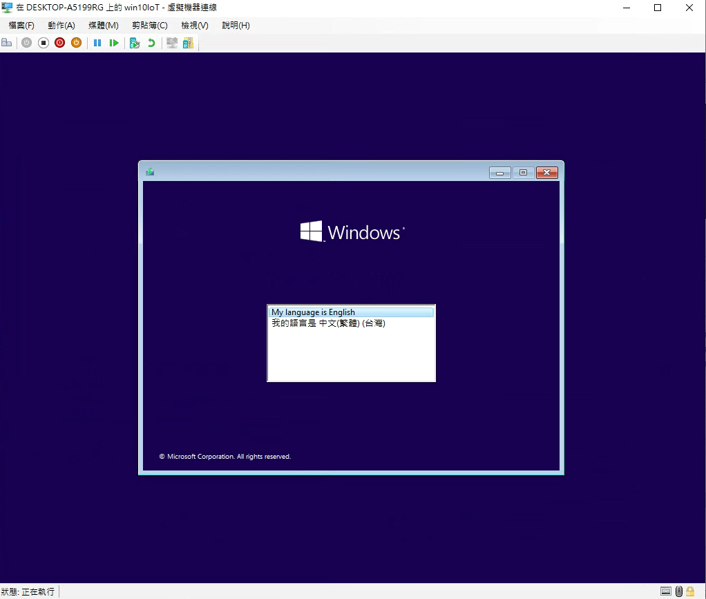

選擇安裝介面語言之後還可以選擇要安裝的語系版本與地區設定。

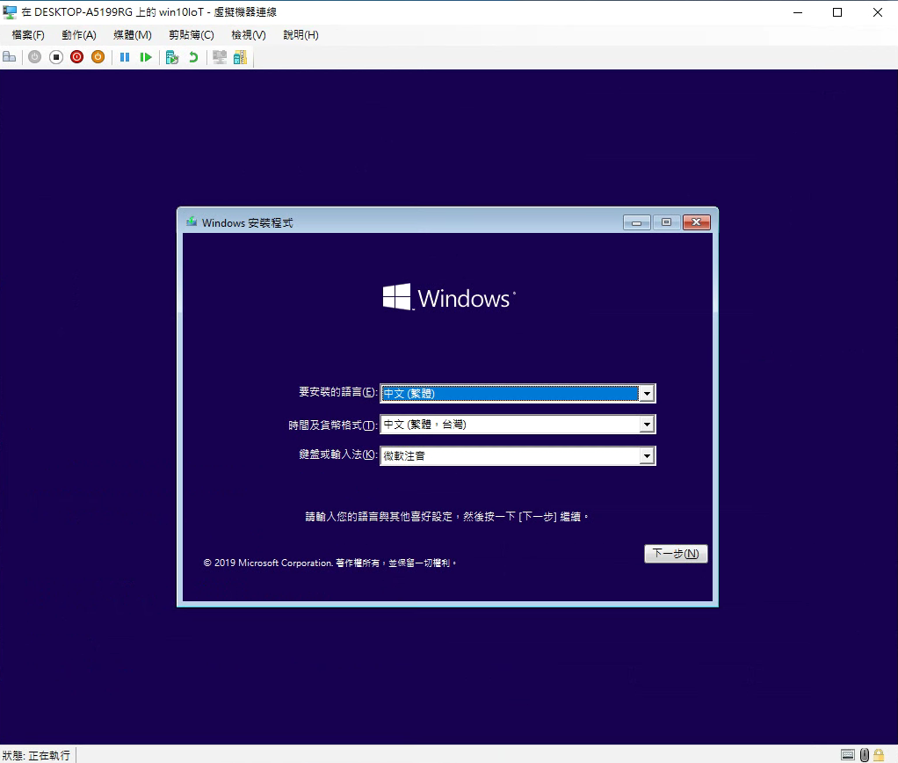
## 參考資料
* Microsoft learm 語言新增:   
https://learn.microsoft.com/zh-tw/windows-hardware/manufacture/desktop/add-language-packs-to-windows?view=windows-11
* 多國語言映像製作:  
https://isite.tw/2016/09/27/16962/2