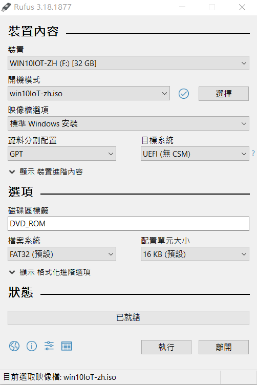

# Windows 母檔製作 #3
## Microsoft CDImage製作

Oscdimg 是命令列工具，可用來建立自訂 32 位或 64 位版本的 Windows 預先安裝環境 (Windows PE) 映射 (.iso) 檔案。 接著，您可以將 .iso 檔案轉換成 CD 或 DVD。 Oscdimg 支援 ISO 9660、Joliet 及通用磁碟格式 (UDF) 檔案系統。
## 開啟"部屬與映像工具環境"

Oscdimg 是命令列工具，可從 Windows Kits 中的"部屬與映像工具環境"使用
```路徑
[開始] 功能表 / [Windows Kits] / [部署和映射工具] 
```
### _Oscdimg 語法_

```
Oscdimg [<options>] <sourceLocation> <destinationFile>
```

### _CD 或 DVD 開機選項_

開機選項可用來建立可開機的 CD 或 DVD 映射。 下列開機選項可用來產生單一開機專案。

| 選項  | 描述 |
| ------------- |:-------------|
| -b< bootSectorFile >     | 指定將在磁片的開機磁區或磁區中寫入的 El Torito 開機磁區檔案。 請勿使用空格。 例如：在 UEFI 上：-bC:\winpe_x86\Efisys.bin 在 BIOS 上： -bC:\winpe_x86\Etfsboot.com|
| -e      | 停用 El Torito 目錄中的磁碟片模擬。     |
| -p     | 指定要用於 El Torito 目錄中平臺識別碼的值。 預設識別碼0xEF表示 UEFI) 系統 (整合可擴展韌體介面。 0x00代表 BIOS 系統。                     |
| < sourceLocation >   | 必要。 指定要建立到 .iso 映像之檔案的位置。     |
| < targetFile >     | 指定 .iso 映像檔的名稱。 |

### _多開機專案_

| 選項  | 描述 |
| ------------- |:-------------|
| b< bootSectorFile >  | 指定將在磁片的開機磁區或磁區中寫入的 El Torito 開機磁區檔案。 請勿使用空格。 例如：在 UEFI 上： bEfisys.bin 在 BIOS 上： bEtfsboot.com |
| -bootdata：< number >  | 指定多開機映射，後面接著開機專案數目。 請勿使用空格。 例如：-bootdata:<3>#< defaultBootEntry >#< bootEntry1 >#< bootEntryN > 其中< 3 >是後續的開機專案數目。|
| e  | 停用 El Torito 目錄中的磁碟片模擬。 |
| p  | 指定要用於 El Torito 目錄中平臺識別碼的值。 預設識別碼0xEF表示 UEFI 系統。 0x00代表 BIOS 系統。 |
| t  | 指定 El Torito 載入區段。 如果未指定，此選項預設為 0x7C0。 |
| < sourceLocation >  | 必要。 指定要建立到 .iso 映像之檔案的位置。 |
| < targetFile >  | 指定 .iso 映像檔的名稱。 |

### _使用單一開機專案建立可開機映射_

* 建立以 UEFI 為基礎的電腦映射檔

```
Oscdimg -bC:\winpe_amd64\Efisys.bin -pEF -u1 -udfver102 C:\winpe_amd64\media C:\winpe_amd64\winpeamd64.iso
```

其中 C:\winpe_amd64\media 是目標壓縮檔案路徑C\winpe_amd64\winpeamd64.iso' 是 .iso 檔案的路徑。

### _使用多開機專案建立可開機映射_

Oscdimg 工具來建立可開機的 CD 或 DVD，方法是使用多開機專案。 當您這樣做時，請注意下列事項：

* bootdata選項後面必須接著命令中的開機專案數目， -bootdata:< number > () 。
* 每個多開機專案都必須使用雜湊符號分隔， (#)。
* 開機專案的每個選項都必須使用逗號 () , 來分隔。
* 每個開機專案都必須指定平臺識別碼。

若要使用多開機專案：
* 使用多開機命令，為以 UEFI 或 BIOS 為基礎的電腦建立映射檔。

```
Oscdimg -bootdata:2#p0,e,bEtfsboot.com#pEF,e,bEfisys.bin -u1 -udfver102 C:\winpe_amd64\media C:\winpe_amd64\winpeamd64.iso
```
其中此命令會啟動 BIOS 映射的 Etfsboot.com 開機檔案，然後啟動 UEFI 映射的 Efisys.bin 開機檔案。

### _範例指令_

可用於前篇壓縮檔案

```
Oscdimg -m -o -u1 -udfver102 -bootdata:2#p0,e,bE:\win10\win10IoT\boot\etfsboot.com#pEF,e,bE:\win10\win10IoT\efi\microsoft\boot\efisys.bin E:\win10\win10IoT E:\win10\win10IoT\win10IoT-zh.iso
```

## USB開機隨身碟

製作USB開機碟，可使用第三方程式製作，例如:Rufus、UltraISO等。

* 下載Rufus

```
https://rufus.ie/zh_TW/
```



選擇剛製作的中文化ISO，選擇目標USB隨身碟，"資料分割配置"選擇 GPT ，"檔案系統" 選擇 FAT32，點選執行即可。

## 系統安裝

將USB插入目標電腦進入安裝頁面，並依照畫面指示進行安裝，安裝完成後即可訂做目標母檔。

## 參考資料

* Microsoft learm CDImage製作:   
  https://learn.microsoft.com/zh-tw/windows-hardware/manufacture/desktop/oscdimg-command-line-options?view=windows-11