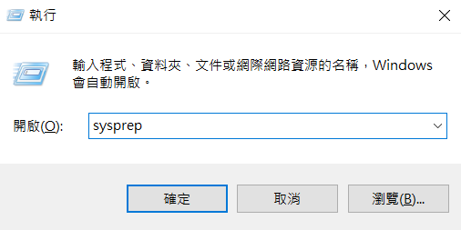
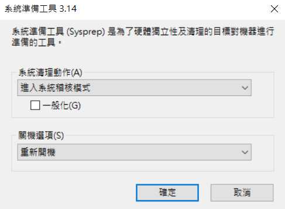
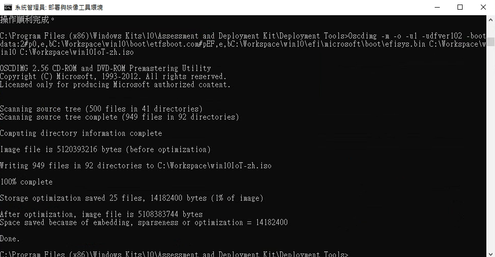
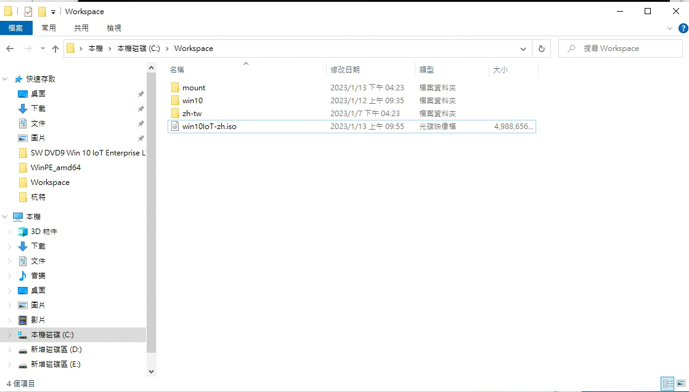

# Windows 母檔製作 #4

## 進入稽核模式

當完成系統安裝後，需開啟稽核模式以保證擷取的母檔完整性，並且在後續安裝其他台主機時，可自行設定使用者與密碼。
### _開啟稽核模式_

進入桌面後，快捷鍵 Win + R 輸入 sysprep。



點擊進入"系統準備工具"



* 系統清理動作 --> 進入系統稽核模式
* 關機選項 --> 重新開機

重開後會進入 administrator使用者介面，開始安裝所需系統程式，並且移除安裝系統時設定的使用者，完成後再叫出"系統諄被工具"，或是由 CMD 輸入終端機指令。

### _Sysprep 設定裝置_

在裝置上開機進入稽核模式時，請從系統管理命令提示字元執行 Sysprep 以準備映射以進行擷取：

```
C:\Windows\System32\Sysprep\Sysprep.exe /generalize /oobe /shutdown
```
Sysprep 準備映射之後，參考裝置將會關閉。 下次裝置開機時，它會開機到 OOBE。

## _警告!!!_

當關機後，請勿直接開啟系統，因設定 OOBE 後，下一次開機會重新添加新的使用者。必須再重新開啟 sysprep。

## Sysprep、擷取和部署

下列步驟會從參考裝置的硬碟擷取 WIM 映射。 此 WIM 可用於開發或生產環境中。 在開發程式的不同階段，通常會擷取 OS 映射。 

### _Step 1 進入 PE 介面擷取姆檔映射:_

使用製作好的 WinPE 系統隨身碟插入到目標裝置，並且開啟進入 PE 系統介面。

系統會開機至 WinPE，您會看到命令提示字元。

### _Step 2 擷取 \C槽並轉換成 wim 檔案格式:_

從 WinPE 命令提示字元中，使用 DISM 來擷取Windows分割區的映射

```
DISM /capture-image /imagefile:C:\install.wim /CaptureDir:C:\ /Name:"Windows 10 IoT Enterprise"
```
/imagefile:C:\install.wim 為生成 wim 檔後放置位置， /CaptureDir:C:\ 為欲擷取檔案位置。

### _Step 3 分割 wim 檔:_

因生成的 wim 檔基本超過4GB，無法直接放入 wimdows安裝映像中，所以必須使用 DISM 工具切割並轉換成 swm 檔案格式。

```
Dism /Split-Image /ImageFile:C:\install.wim /SWMFile:C:\install.swm /FileSize:4000 
```
## 建立母檔映像

把分割後的 swm 檔提取出來，替換到原本 wimdows 安裝碟的檔案，再重新封裝成ISO檔，即可完成母檔製作。

### _Step 1 複製安裝映像:

在電腦中建立一個資料夾，並將USB安裝碟的資料複製至該資料夾，點擊進入sources資料夾，將其中 install.wim 替換成分割後的 install.swm 檔(可能會有多的 swm 檔)。

### _Step 2 壓縮成母檔 ISO :

進入 Windows Kit 中"部屬與映像工具" 利用上篇製作 ISO 格式檔方式把檔案重新壓縮:

```路徑
[開始] 功能表 / [Windows Kits] / [部署和映射工具] 
```
輸入 ISO 製作指令:

```
Oscdimg -m -o -u1 -udfver102 -bootdata:2#p0,e,bE:\win10\win10IoT\boot\etfsboot.com#pEF,e,bE:\win10\win10IoT\efi\microsoft\boot\efisys.bin E:\win10\win10IoT E:\win10\win10IoT\win10IoT-zh.iso
```



## 參考資料

* Sysprep、擷取和部署

https://learn.microsoft.com/zh-tw/windows-hardware/manufacture/desktop/iot-ent-sysprep-capture-deploy?view=windows-11

* 建立基本映射 (iot-ent-create-a-basic-image)

https://learn.microsoft.com/zh-tw/windows-hardware/manufacture/desktop/iot-ent-create-a-basic-image?view=windows-11